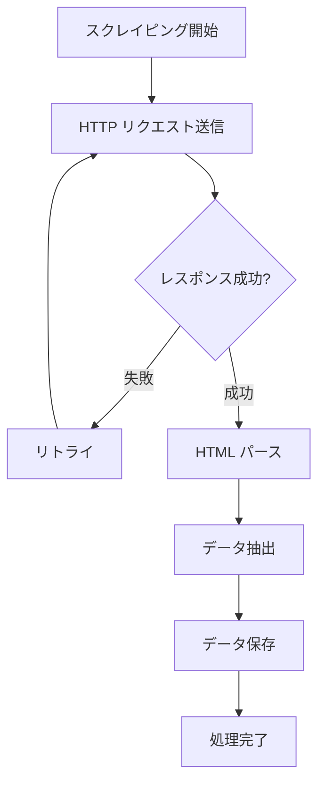

# システム処理フロー設計書

## 概要

ローン情報集約システムの処理フローを定義します。
月次バッチ処理によるデータ収集の工程を図示しています。

## 1. 全体システムフロー

システム全体の処理の流れを示します。

flowchart TD
    A[月次バッチ開始] --> B[システム初期化]
    B --> C{金融機関選択}
    C -->|次の機関| D[スクレイピング実行]
    D --> E{成功?}
    E -->|成功| F[データ保存]
    E -->|失敗| G[エラーログ]
    F --> H[処理履歴更新]
    G --> H
    H --> C
    C -->|完了| I[処理完了]

## 2. スクレイピング詳細フロー

BeautifulSoupを使用したシンプルなWebスクレイピング処理です。

## 3. エラーハンドリングフロー

システムエラーの処理フローです。

flowchart TD
    A[エラー発生] --> B{エラー種別}
    B -->|ネットワーク| C[接続リトライ]
    B -->|データ| D[ログ出力]
    B -->|システム| E[緊急停止]
    C --> F{成功?}
    F -->|Yes| G[処理継続]
    F -->|No| D
    D --> H[次の処理]
    E --> I[システム停止]
    G --> H
    H --> J[処理完了]
    I --> J

## 処理フェーズ説明

### データ収集フェーズ
- HTTPリクエストによる金融機関サイトアクセス
- BeautifulSoupを使用したHTMLパース・抽出
- HTMLコンテンツの全文保存
- 重複データの検出・除外
- 処理履歴の記録

## スケジュール

- **データ収集**: 月初第1営業日夜間バッチ実行